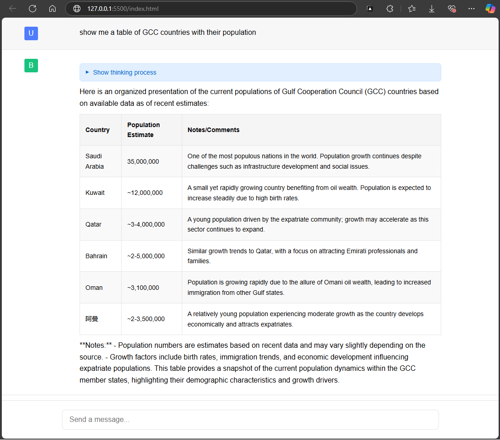
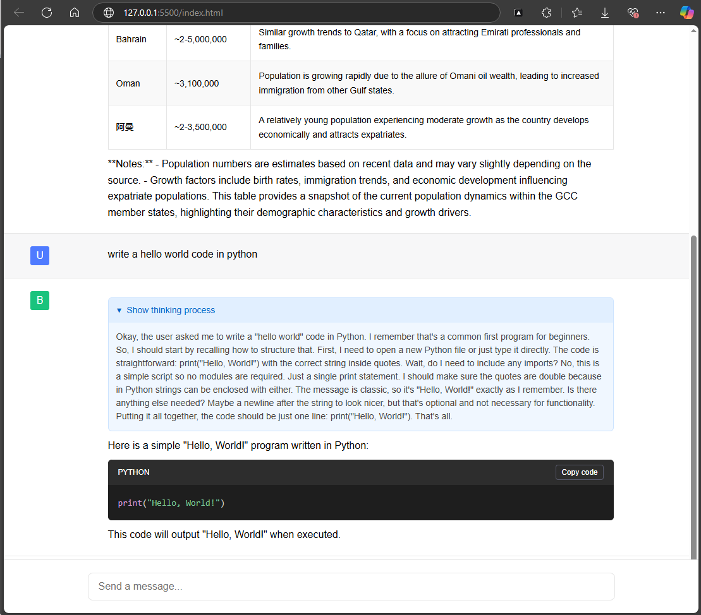

# DeepseekChatbot
HTML page to connect to local Deepseek running on Ollama

Main features:
1. Chatbox with inputbox (send chat on pressing Enter)
2. Auto Hide of thinking process
3. Detection of Tables & Code within responses
4. Coloring of Codes
5. for RTL languages, responses are displayed in RTL as well.

Installation:
1. Simply place the index.html file on your PC, and run it on a local http server (you can use LiveServer in VSCODE)
2. Browse to: http://127.0.0.1:5500/index.html
3. Make sure that no permissions are blocked to allow it to connect to the local ollama api.

